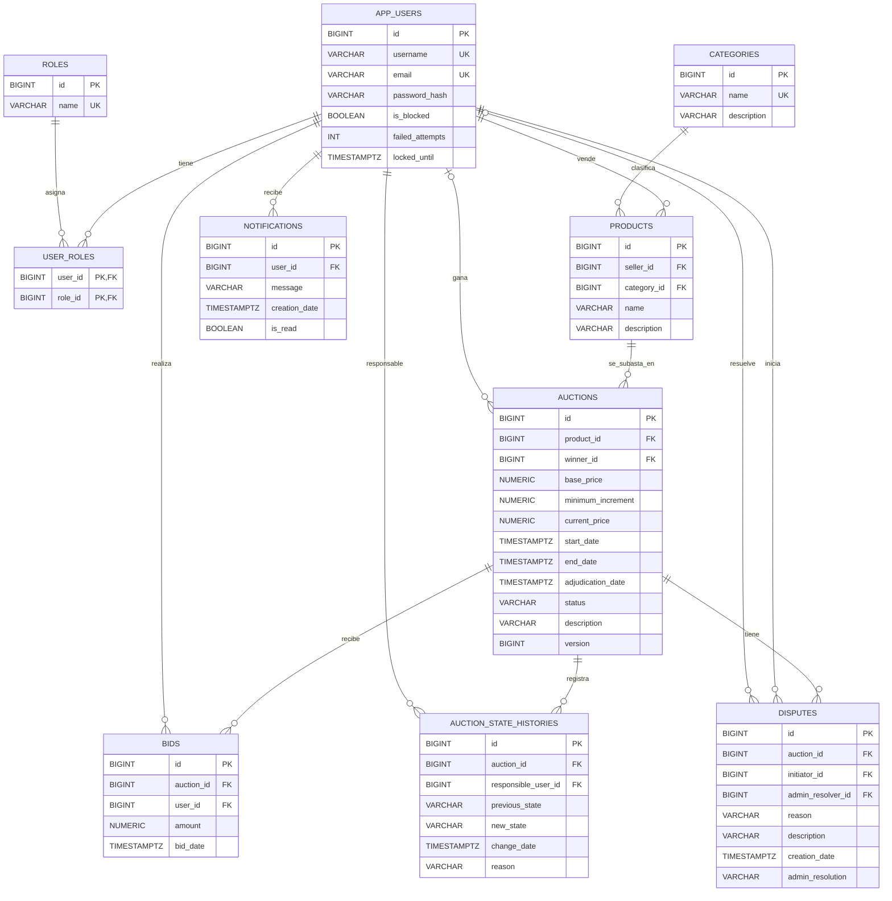

# DER - Sistema de Subastas Online

## Relaciones principales

| Relación | Cardinalidad | Explicación |
|---|---:|---|
| `APP_USERS` - `ROLES` | N:M | Un usuario puede tener varios roles y un rol puede pertenecer a varios usuarios. Se resuelve con `USER_ROLES`. |
| `APP_USERS` - `PRODUCTS` | 1:N | Un vendedor puede cargar varios productos. Cada producto pertenece a un vendedor. |
| `CATEGORIES` - `PRODUCTS` | 1:N | Una categoría puede tener varios productos. Cada producto tiene una categoría. |
| `PRODUCTS` - `AUCTIONS` | 1:N | Una subasta se crea sobre un producto. A nivel de BD un producto podría aparecer en varias subastas porque no hay restricción `UNIQUE` sobre `product_id`. |
| `APP_USERS` - `AUCTIONS` | 0..1:N | Una subasta puede tener un ganador o no. Un usuario puede ganar muchas subastas. |
| `AUCTIONS` - `BIDS` | 1:N | Una subasta puede recibir varias pujas. Cada puja pertenece a una subasta. |
| `APP_USERS` - `BIDS` | 1:N | Un usuario puede realizar varias pujas. Cada puja pertenece a un usuario. |
| `AUCTIONS` - `AUCTION_STATE_HISTORIES` | 1:N | Cada cambio de estado de una subasta queda registrado en el historial. |
| `APP_USERS` - `AUCTION_STATE_HISTORIES` | 1:N | Cada registro de historial tiene un usuario responsable. |
| `APP_USERS` - `NOTIFICATIONS` | 1:N | Un usuario puede recibir muchas notificaciones. |
| `AUCTIONS` - `DISPUTES` | 1:N | Una subasta puede tener reclamos o disputas. |
| `APP_USERS` - `DISPUTES` | 1:N | Un usuario puede iniciar varias disputas. |
| `APP_USERS` - `DISPUTES` | 0..1:N | Una disputa puede tener un administrador resolutor o quedar pendiente. |

## Observaciones

- La subasta no guarda un vendedor directo; el vendedor se obtiene desde `Auction -> Product -> Seller`.
- La notificación no guarda título, tipo ni subasta asociada; guarda usuario, mensaje, fecha y si fue leída.
- La disputa no tiene estado propio en base de datos; el estado que cambia es el de la subasta.
- Existen enums como `DisputeStatus` y `NotificationType`, pero el modelo actual no los usa en las entidades persistidas.
