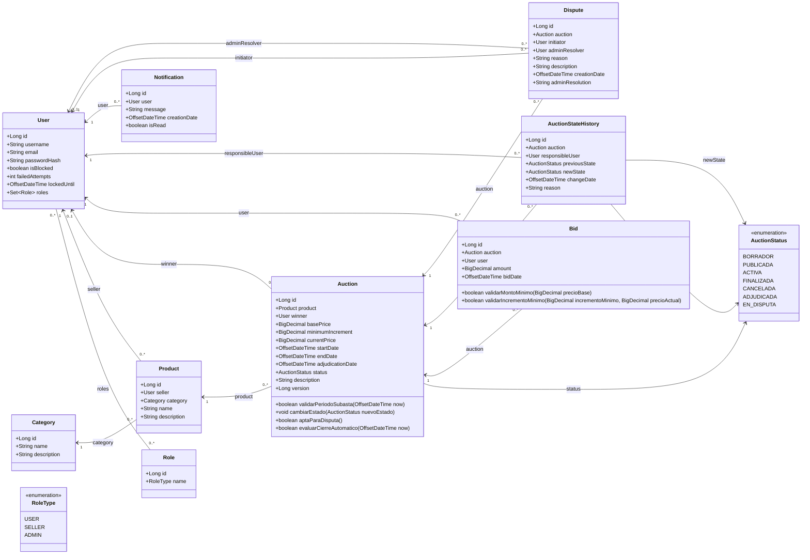

# Diagrama de Clases UML - Sistema de Subastas Online

## Lectura del diagrama

- `User` representa a los usuarios del sistema. Puede tener uno o más roles mediante la relación con `Role`.
- `Product` pertenece a un vendedor (`User`) y a una `Category`.
- `Auction` pertenece a un `Product`. El vendedor de la subasta se obtiene indirectamente desde el producto.
- `Auction` puede tener un `winner`, que es un `User`. Al crear la subasta este valor puede ser nulo.
- `Bid` representa una puja realizada por un usuario sobre una subasta.
- `AuctionStateHistory` registra los cambios de estado de la subasta, el usuario responsable, la fecha y el motivo.
- `Notification` representa los avisos internos para usuarios.
- `Dispute` representa un reclamo sobre una subasta adjudicada. Puede tener un administrador resolutor cuando ya fue resuelta.

## Observaciones

- Este diagrama está centrado en clases de dominio, no en controladores, servicios, DTOs ni repositorios.
- Los enums `DisputeStatus` y `NotificationType` existen en el código, pero no se incluyen como relaciones porque actualmente no están usados por `Dispute` ni por `Notification`.
- El estado principal de una disputa se refleja mediante el estado de la subasta (`EN_DISPUTA`, `ADJUDICADA`, `FINALIZADA`, `CANCELADA`) y la resolución administrativa guardada en `Dispute.adminResolution`.
